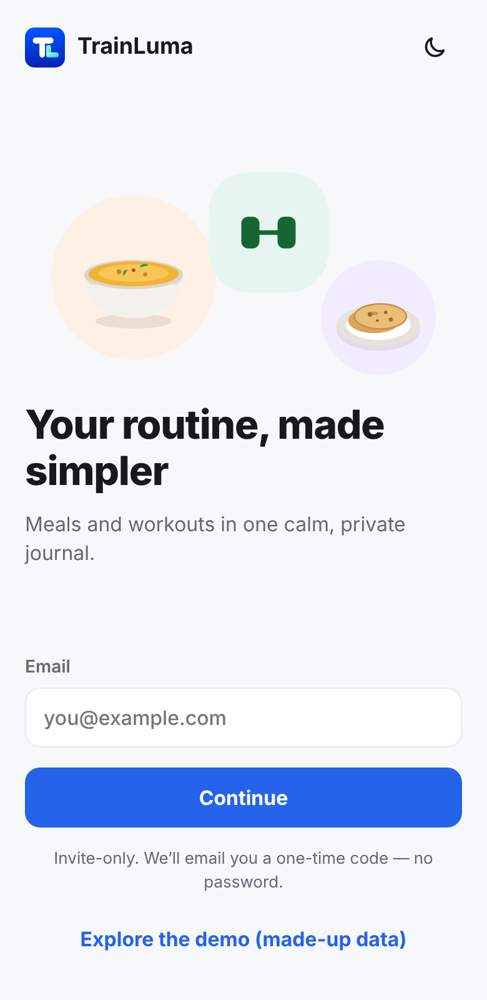
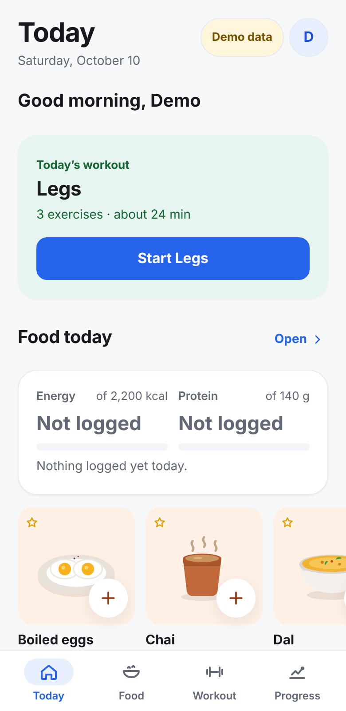
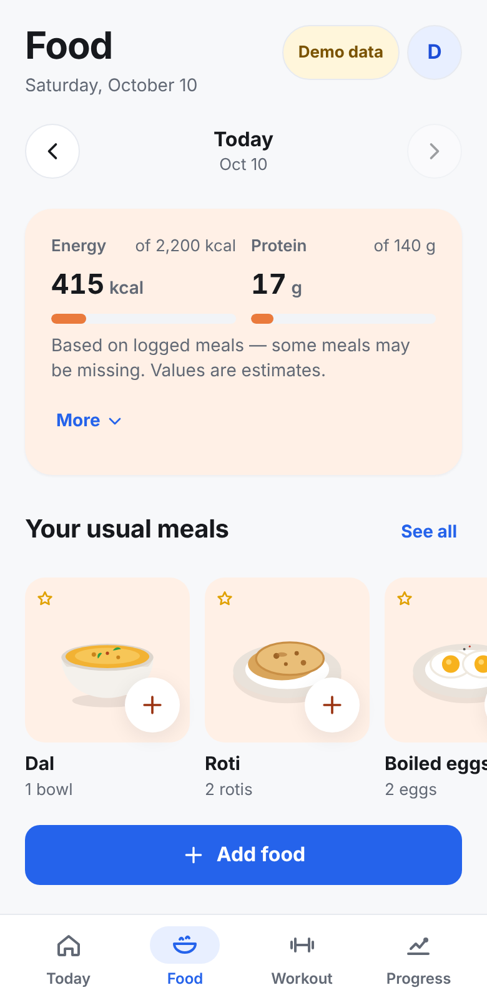
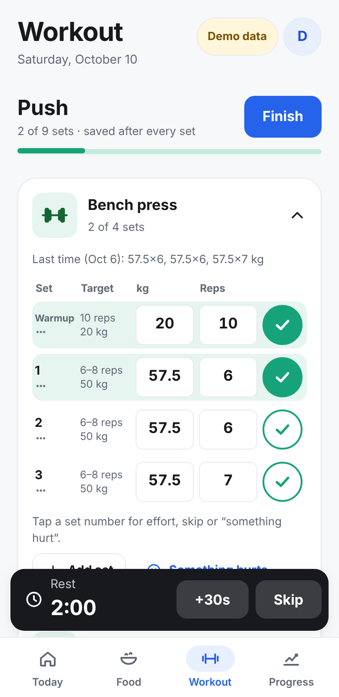
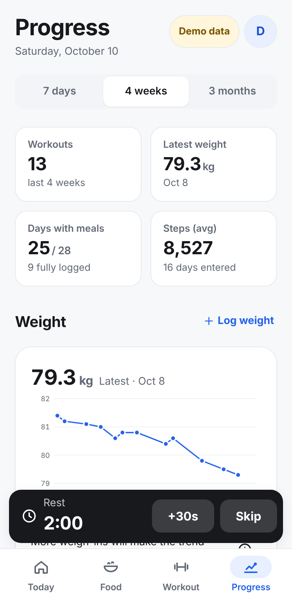
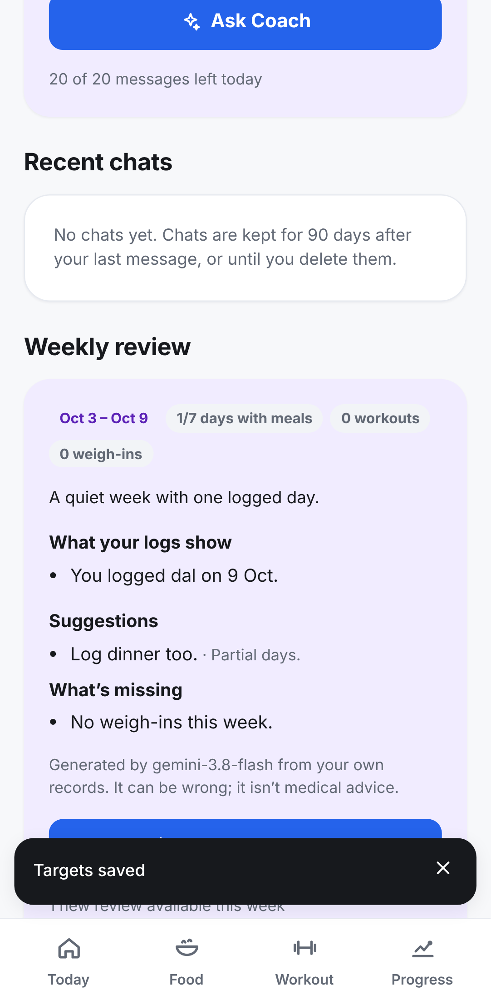

# TrainLuma


**TrainLuma** (formerly Rozana) is a private, phone-first meal and workout journal for a few invited adults. It is a hobby project, not a commercial product, and has no public sign-up.

**Status:** V2 adds a 293-food Punjabi Canadian food list with original pictures, personalised onboarding with optional photos and an AI-drafted plan you approve, and a text AI Coach. The redesign is complete and runs locally. It has a light, calm interface, editable workout plans, natural meal logging, email-code sign-in with approved membership, cloud backup/sync, and an AI coach behind an authenticated backend. Live sign-in, backup and AI need the owner's one-time setup (Supabase, email sender, paid Gemini key). Until then the app offers a clearly labelled demo. See [`docs/BUILD_STATUS.md`](docs/BUILD_STATUS.md) for exactly what has been tested.

| Welcome | Today | Food | Workout | Progress | Coach |
|---|---|---|---|---|---|
|  |  |  |  |  |  |

## Requirements
- Node.js **22.12+** (tested with 22.22.0) and npm 10. `.nvmrc` pins 22. All dependency versions are pinned and `package-lock.json` is committed.
- Optional: PostgreSQL 15+ binaries for the database tests (tested with 16.15; set `PG_BIN` if needed).
- Optional: Playwright 1.56.1 with Chromium for browser tests.
- Optional: Deno 2.x for the Edge Function smoke test (tested with 2.9.6), or the Supabase CLI for deployment.

## Run it
```bash
npm ci
npm run dev                         # http://localhost:5173 — demo works with no setup
npm run build && npm run preview    # production build with offline support on :4173
```
To use real sign-in, copy `.env.example` to `.env.local` and fill in the **publishable** values only (see the owner guide).

## Checks
| Command | What it runs |
|---|---|
| `npm run check` | typecheck + lint + unit tests + build + secret scan |
| `npm test` | domain, storage, sync, meal/plan builder, catalogue, artwork coverage, AI handler, plan rules and prompt-install tests (Vitest) |
| `npm run test:db` | throwaway PostgreSQL + both migrations + isolation/sync/quota tests |
| `npm run test:e2e` | Playwright on two builds: demo, and an auth harness with a scripted fake Supabase |
| `DENO=… npm run smoke:ai` | the real `ai` Edge Function in Deno against a mock Supabase |
| `npm run scan:secrets` | tracked files, git history and `dist/` scanned for credentials and source maps |
| `npm run screenshots` | renders the review screenshots (needs `npm run preview` running) |
| `node scripts/build-coach-prompt.mjs [--check]` | installs/checks the single versioned coach prompt from `docs/spec/AI_FITNESS_COACH_SYSTEM_PROMPT_V2.md` |
| `node scripts/render-icons.mjs` | renders install icons from the owner's TL logo |

## Layout
```
src/app/              boot (auth → journal → onboarding/shell), routing, journal context, service worker
src/core/auth/        Supabase client (lazy), session/membership state, friendly auth errors
src/core/sync/        foreground sync engine (push/pull, idempotent, conflict copies) + transport
src/core/ai/          AI client (session token only) and on-device photo cropping/re-encoding
src/core/database/    IndexedDB v2, Journal (record + outbox in one transaction), demo seed, restore
src/core/design/      tokens, styles, components, food illustrations, icons, theme
src/domain/           nutrition maths, training sessions and plan editing, metrics
src/features/         today, food, workout, progress, coach, settings, auth, onboarding
shared/               contracts (zod) and fixtures (demo data, exercise library)
supabase/migrations/  0001 schema/RLS, 0002 sync + membership + deletion + AI accounting, 0003 chat, plan drafts, photos, permissions
supabase/functions/   ai Edge Function (wiring) + _shared (tested logic, coach prompt, exercise catalogue, food list data)
supabase/admin/       owner SQL for approving members and setting AI limits
tests/e2e/            Playwright specs + mock Supabase
docs/                 build status, owner guide, security/data flow, design, decisions, screenshots
```

## Secrets
Only `VITE_SUPABASE_URL` and `VITE_SUPABASE_PUBLISHABLE_KEY` may reach the browser. `GEMINI_API_KEY` and Supabase secret keys live only in Supabase Edge Function secrets, entered by the owner. The build's CSP allows the browser to reach only this site and your Supabase project.

## Documents
[Build status](docs/BUILD_STATUS.md) · [Owner guide](docs/OWNER_GUIDE.md) · [Security & data flow](docs/SECURITY_AND_DATA_FLOW.md) · [Design & screens](docs/WIREFRAMES.md) · [Decisions](docs/DECISIONS.md) · [Redesign gap list](docs/REDESIGN_GAPS.md) · [Specs](docs/spec/)
