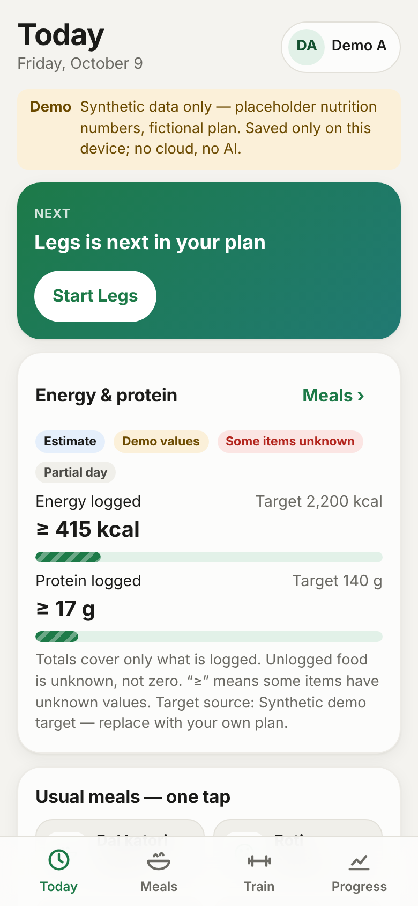
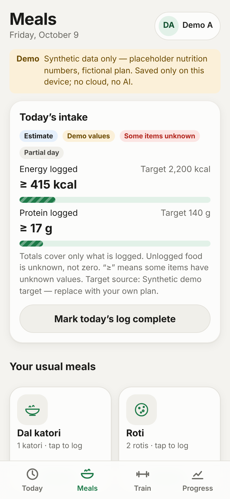
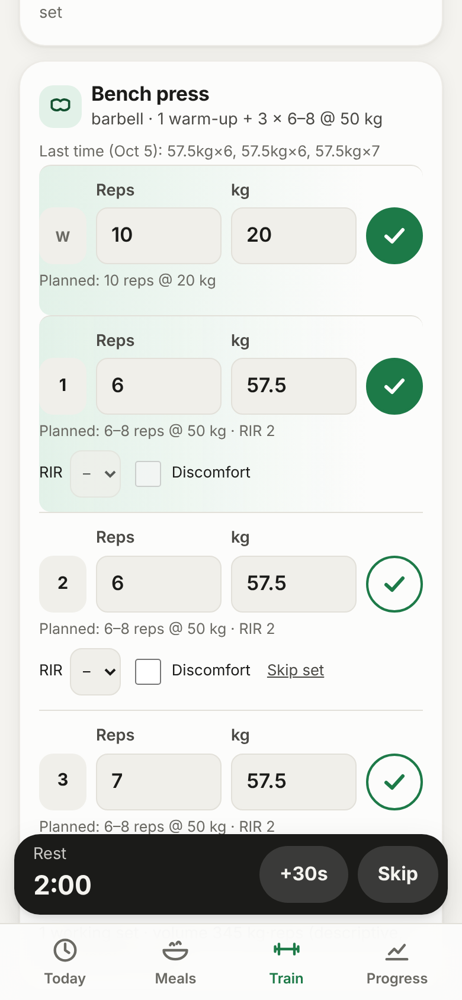
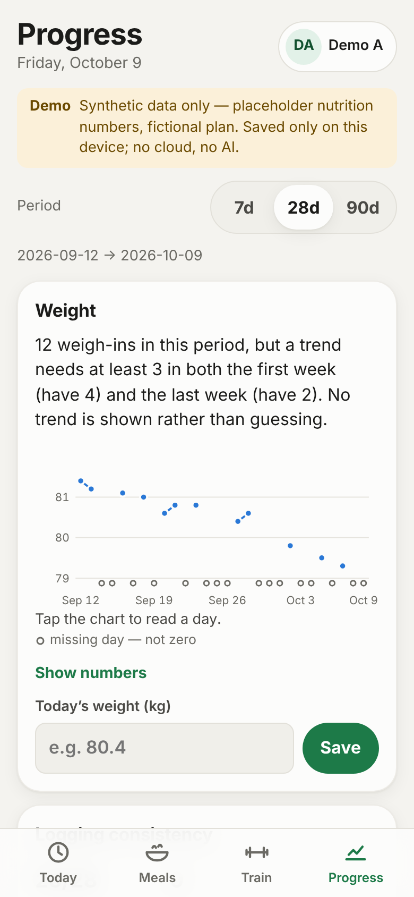

# AapnaFit Private

A private, phone-first meal and workout journal for a few people. It is a personal hobby project. It is not a commercial product, and it has no sign-up page.

**Status:** Phase 0 (foundations plus a local demo). Everything runs in the browser on one device with **synthetic demo data**. There is no cloud sync, no login, and no AI yet. See [`docs/BUILD_STATUS.md`](docs/BUILD_STATUS.md) for what has actually been tested and what comes next.

| Today | Meals | Train | Progress |
|---|---|---|---|
|  |  |  |  |

## Requirements

- Node.js **22.12 or newer** (LTS; tested with 22.22.0) and npm 10 (tested with 10.9.4). `.nvmrc` pins 22.
- Optional, for database tests: PostgreSQL **15+** binaries (tested with 16.15). Set `PG_BIN` if they are not in `/usr/lib/postgresql/16/bin`.
- Optional, for browser tests: Playwright 1.56.1 with Chromium (`npx playwright install chromium` once on your own machine).

All dependency versions are pinned exactly in `package.json`, and `package-lock.json` is committed.

## Run it

```bash
npm ci                 # install exactly the locked versions
npm run dev            # open http://localhost:5173 (use your browser's phone/device mode)
```

To test the installable/offline build:

```bash
npm run build && npm run preview   # http://localhost:4173 — includes the service worker
```

The demo starts as **Demo A** with five weeks of synthetic history. Today starts empty so you can try logging. Switch to **Demo B** (lb units, no targets) under the profile button. *Settings → Reset demo data* regenerates a profile.

## Checks

| Command | What it runs |
|---|---|
| `npm run check` | typecheck + lint + unit tests + production build + secret scan |
| `npm test` | unit/persistence tests (Vitest, in-memory IndexedDB) |
| `npm run test:db` | starts a throwaway local PostgreSQL, applies the migration, and runs the member-isolation tests |
| `npm run test:e2e` | builds, serves, and drives the app in Chromium at phone size |
| `npm run scan:secrets` | scans tracked files, git history and `dist/` for credentials and source maps |

## Layout

```
src/app/                 shell, routing, journal context, service-worker registration
src/core/database/       IndexedDB schema, Journal (record + outbox in one transaction), demo seed
src/core/design/         design tokens, styles, original SVG icons, theme
src/core/time/           local-date / timezone helpers
src/domain/nutrition/    deterministic nutrient maths (batch/portion, unknown = null, snapshots)
src/domain/training/     sessions, planned vs actual, comparable history, e1RM estimate, rest timer
src/domain/metrics/      series with missing days kept missing, weight trend, logging consistency
src/features/            today, meals, train, progress, coach (placeholder), settings
src/sw/sw.js             app-shell-only service worker (precache list injected at build)
shared/contracts/        zod schemas shared by client and future backend
shared/fixtures/         clearly labelled synthetic demo data
supabase/migrations/     PostgreSQL schema, grants, RLS, RPC (not yet applied to any project)
supabase/tests/          isolation tests + local stand-in for Supabase's auth schema
tests/e2e/               Playwright browser tests
docs/                    status, decisions, wireframes, security/data-flow, owner guide, spec
```

## Secrets

Phase 0 needs **no** environment variables. `.env.example` only holds placeholders. Only `VITE_SUPABASE_URL` and `VITE_SUPABASE_PUBLISHABLE_KEY` may ever reach the browser. The Gemini key and the Supabase secret/service-role keys belong only in Supabase backend secrets, and the owner enters them in the dashboard. Never paste them into chat or commit them. See [`docs/SECURITY_AND_DATA_FLOW.md`](docs/SECURITY_AND_DATA_FLOW.md).

## Documents

- [`docs/BUILD_STATUS.md`](docs/BUILD_STATUS.md): phase, checks actually run, open issues, next action
- [`docs/DECISIONS.md`](docs/DECISIONS.md): decision record and scope
- [`docs/WIREFRAMES.md`](docs/WIREFRAMES.md): design tokens and the four main screens
- [`docs/SECURITY_AND_DATA_FLOW.md`](docs/SECURITY_AND_DATA_FLOW.md): threat and data-flow notes
- [`docs/OWNER_GUIDE.md`](docs/OWNER_GUIDE.md): how to try it, backup/export, deletion, what is stored where
- [`docs/spec/`](docs/spec/): the system specification and the owner checklist this build follows
